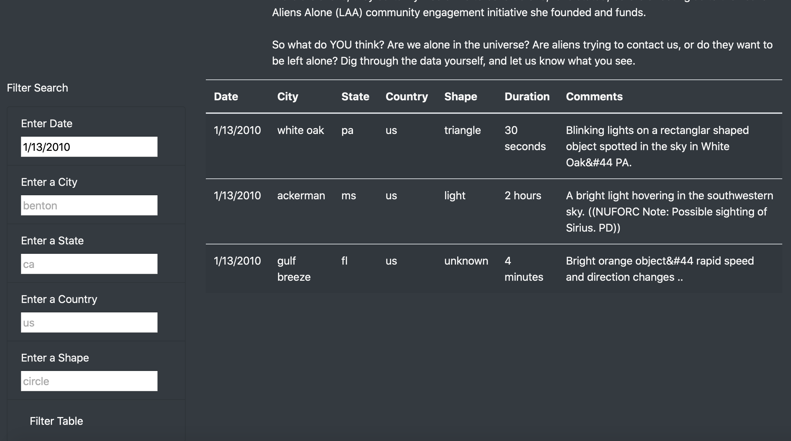

# Overview of Project
---
 Organized UFO data that is stored as a JavaScript array, or list and in-depth analysis of UFO sightings by allowing users to filter for multiple criteria at the same time. In addition to the date, user can add filters for the city, state, country, and shape.

 # Results
 ---
- User can filter data by Date, City, State, Country and Shape

- User filtered the data by `Date-1/13/2010`

- User filtered the data by `City- st. louis`

- User filtered the data by `State-Arkansas/ar`

- User filtered the data by `Country-Canada/ca`

- User filtered the data by `Shape-disk`

 # Summary
 ---
 ## Drawback
- Webpage is not very interactive 

## Recommendations
- Add light theme and toggle button for user to switch between the themes 
- Add a list of cities, state, Country and shape as a dropdown in filter for user to select, as it would be easy to select rather than input the value, so that user can easily search on the value available  
